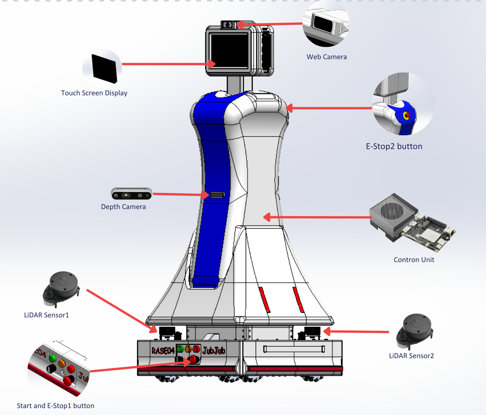
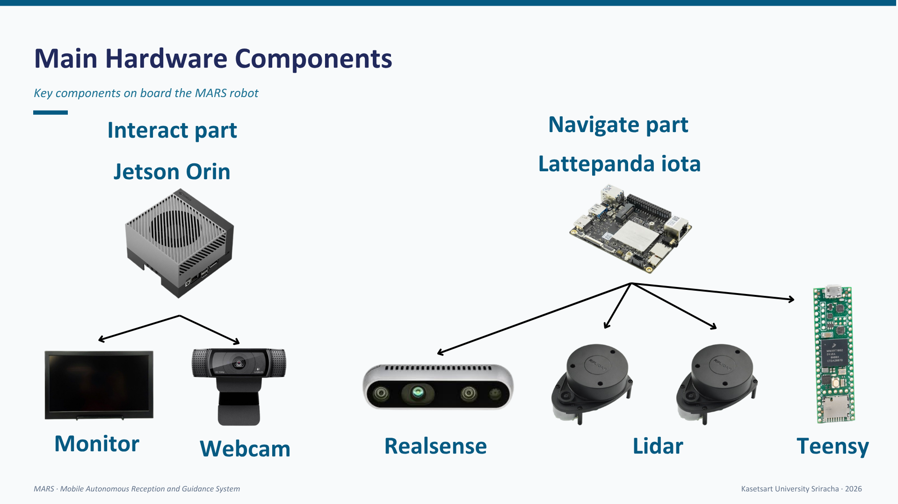

# MARS: Mobile Autonomous Reception and Guidance System

An autonomous reception robot designed to provide indoor guidance, interactive AI-driven conversations, and seamless navigation for visitors. Developed as a final project by the Robotics and Automation Systems Engineering program, Kasetsart University Sriracha.

## Project Overview
Visitors in multi-floor buildings frequently face wayfinding difficulties, while traditional static signs lack interactivity and human receptionists have limited availability. 

**MARS** solves this by acting as a 24/7 service robot capable of autonomous indoor navigation, face detection, and natural bilingual (Thai/English) voice interaction.

## System Architecture

### Hardware Components

The robot features a custom aluminum profile chassis (20x20 mm T-slot) with a 3D-printed outer shell, weighing approximately 45 kg.
* **Interaction Unit:** NVIDIA Jetson AGX Orin handling AI, LLM, and computer vision.
* **Navigation Unit:** LattePanda iota managing ROS2 Nav2 and SLAM.
* **Microcontroller:** Teensy for low-level motor control and sensor reading.
* **Sensors:** 2x RPLIDAR A1 (Front/Rear), Intel RealSense RGB-D Camera, Webcam, and Touch Screen Display.

### Software & AI Stack
* **Autonomous Navigation:** * **SLAM:** Graph-based SLAM using `slam_toolbox` (Karto engine) with dual LiDAR merger.
  * **Localization:** Adaptive Monte Carlo Localization (AMCL) using particle filters.
  * **Path Planning:** ROS2 Nav2 utilizing NavFn (Dijkstra/A*) for global planning and DWB for local planning.
* **Computer Vision:** Real-time face detection using MediaPipe BlazeFace to wake the system from idle.
* **Conversational AI (LLM & Voice):** * Speech-to-Text via Silero VAD.
  * Multimodal LLM serving via VLLM Gemma 4 with **Tool Calling** capabilities (e.g., `Maps_room`, `get_floor_info`).
  * Text-to-Speech using Kokoro (English) and gTTS (Thai).

## Multi-Layer Safety System (Defense-in-Depth)
Safety is critical for a public-facing service robot. MARS implements a 3-tier safety mechanism:
1. **L1 Bumper (Reactive):** Physical contact detection that forces the robot to reverse or halt.
2. **L2 LiDAR (Proactive):** Dynamic obstacle avoidance and concentric safety zones limiting speed upon human approach.
3. **L3 Emergency Stop:** Manual hardware E-Stop buttons to immediately cut power.

## Setup and Installation
*(Add your specific instructions here on how to build the ROS2 workspace, install dependencies like PyTorch, OpenCV, and configure the VLLM server)*

## Limitations & Future Work
While the core systems are fully operational, the platform is designed for continuous improvement:
* **Offline Capabilities:** Transitioning from cloud LLM dependency to full on-device LLM inference.
* **Navigation:** Expanding from single-floor operation to multi-floor navigation via elevator integration[cite: 505, 513].
* **Hardware:** Implementation of an automated charging dock and potential robotic arm for simple object manipulation[cite: 512, 514].
* **AI:** Enhancing wake word accuracy in noisy environments and adding emotion recognition.

## Contributors
**Robotics and Automation Systems Engineering (RASE), Kasetsart University Sriracha** 
* Chanaprachpakorn Ngernmo
* Theerapol Guanmuantai
* Rachen Wanbunma

**Advisor:** Asst.Prof. Songchai Jitpakdeebodin